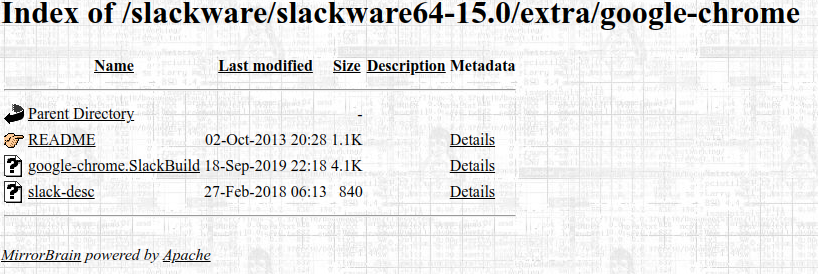

# install-chrome-slackware
## Tutorial para instalação do Google Chrome no Slackware
---

1) Acessar o site abaixo: 

   https://mirrors.slackware.com/slackware/slackware64-15.0/extra/google-chrome/
   
3) Abrir o arquivo _google-chrome.SlackBuild_ que aparece na imagem abaixo:

   
   
